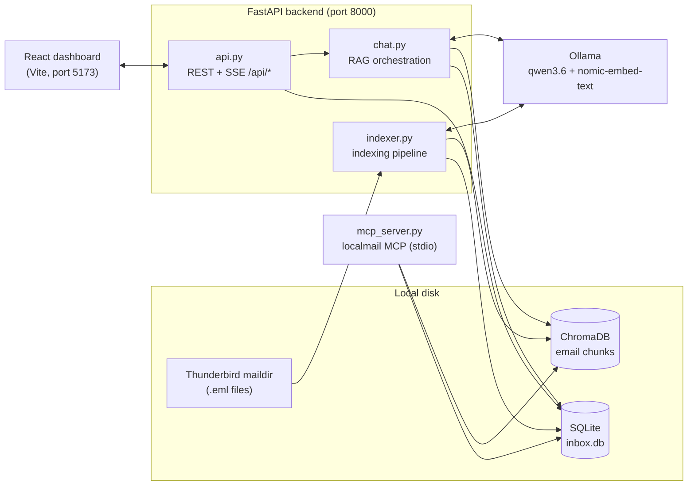
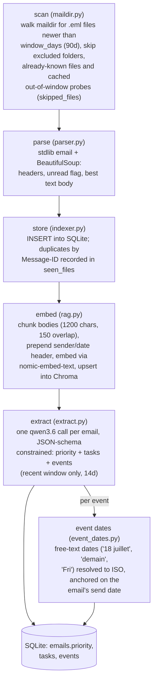
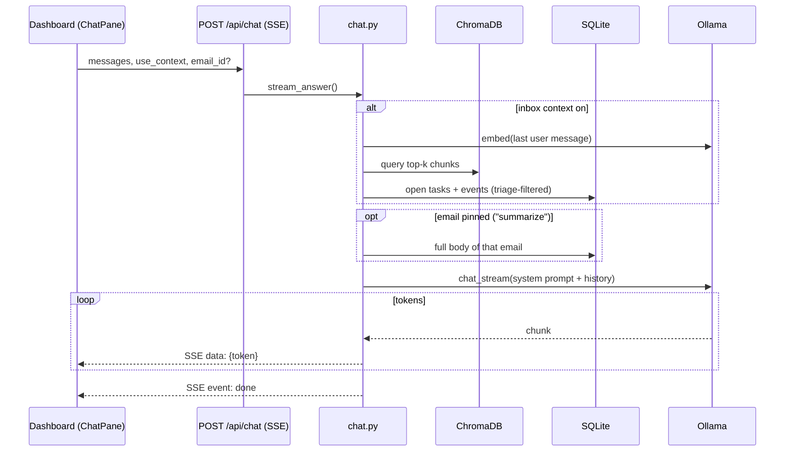

# Architecture

Everything runs locally: mail is read from the Thunderbird maildir on disk,
models run on Ollama, and all state lives in `backend/data/`.

## Components

The **dashboard** (`src/App.jsx`) talks only to the REST API. The **MCP
server** is a separate stdio process exposing read-only tools
(`search_mail`, `get_thread`, `list_tasks`, `list_events`) over the same
SQLite/Chroma index, for use from Claude Code.

## Indexing pipeline: from .eml file to categorized email

One pass of `indexer.run_index()` — triggered at backend startup and by the
UI's reindex button — runs four phases. Progress is exposed live via
`GET /api/status`, and a lock guarantees a single run at a time.

Categorization happens in the **extract** phase: the LLM assigns
`priority` (high/medium/low) and pulls out actionable `tasks` and
date-bound `events` per email. Only emails inside
`extraction_window_days` get an LLM call; dismissed emails and muted
senders are skipped entirely. Failures are marked `extracted = 1` with
priority `low` so they are not retried forever.

### Triage filtering

Every triage surface (priority list, tasks, events, stats, chat context)
applies `triage_filter()`: dismissed emails and muted senders are excluded.
Plain mail listing ("all") and semantic search are not filtered — flagged
mail stays visible there, dimmed, with undo.

## Email reading view

Expanding an email in the UI calls `GET /api/emails/{id}/body`
(`mail/render.py`). The DB only stores extracted plain text, so the
endpoint re-opens the source `.eml` (path recovered from the stored
`maildir_file`) and converts its HTML part to Markdown with `markdownify`
— which works for already-indexed mail without any re-index. Safety
measures: images are stripped server-side (loading them would fire
tracking pixels), `script`/`style`/`head` never reach the output, the
frontend renders through `react-markdown` (raw HTML is escaped, no XSS
path), disallows `img` again client-side, and forces links to open in a
new tab with `rel="noopener noreferrer"`.

### Degradation heuristic

Marketing emails built from nested layout tables convert into walls of
tracking links and pipe tables. Instead of guessing from sender headers
(bulk mail can render fine), the converted *output* is scored; the
rendering is flagged degraded when any signal trips:

| Signal | Meaning | Threshold |
|---|---|---|
| link density | fraction of the markdown occupied by `[text](url)` constructs | > 0.5 |
| markup overhead | markdown length ÷ visible-text length of the HTML | > 2.5 |
| table lines | fraction of non-empty lines that are `\|` table rows | > 0.3 |

Degraded emails fall back to the stored plain text with `degraded: true`
in the response; the UI shows a "layout too complex — showing plain text"
flag with a **render anyway** button, which refetches with
`?force_markdown=true` (and can toggle back). Per-conversion scores are
logged by the backend so the thresholds (constants at the top of
`mail/render.py`) can be tuned against a real mailbox.

## Chat: RAG over the inbox

The system prompt embeds the retrieved excerpts, the open task/event lists,
and — when the user pinned an email via the summarize button — that email's
full text. Answers stream token-by-token over SSE and are rendered as
Markdown in the chat panel.

## Data stores

| Store | Path | Contents |
|---|---|---|
| SQLite | `backend/data/inbox.db` | emails, tasks, events, muted_senders, seen_files, skipped_files, meta (settings overrides, last_indexed) |
| ChromaDB | `backend/data/chroma/` | one collection `emails`: body chunks + embeddings, keyed `emailId:chunkIndex` |

SQLite runs in WAL mode with a fresh connection per operation, so the
FastAPI event loop, the background indexer, and the MCP server process can
read concurrently.
